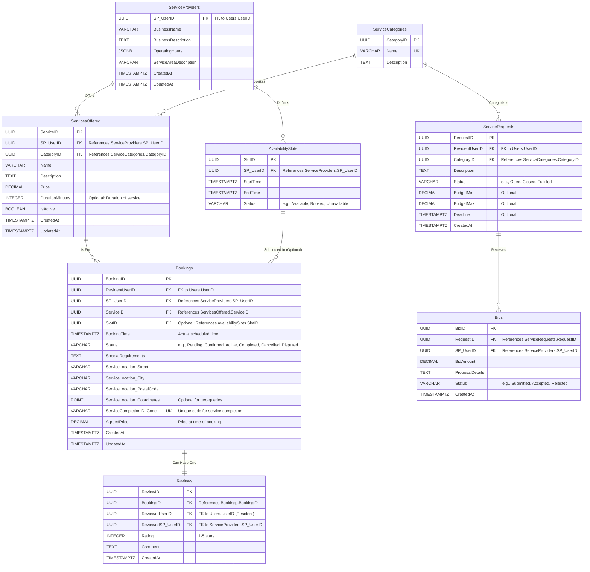

# Service & Booking Management Service - Database Schema Example

This document provides a detailed example of the database schema for the **Service & Booking Management Service**, illustrating how to apply the structure defined in the main `Database-Schema-Outline.md`.

## 1. Introduction & Overview

The Service & Booking Management Service is responsible for managing service provider profiles (as they relate to services offered), the services themselves, service categories, provider availability, the booking lifecycle, and user reviews for completed services. It also handles service requests from residents and bids from providers.

**Schema Name (if applicable for schema-per-service):** `service_booking_schema`

## 2. Entity-Relationship Diagram (ERD)

## 3. Table Definitions

### `ServiceProviders`

*   **Description:** Stores profile information specific to Service Providers, extending the core `Users` entity from the User Management Service.
*   **Columns:**
    | Column Name            | Data Type         | Constraints                                      | Nullable | Default Value | Description / Notes                               |
    |------------------------|-------------------|--------------------------------------------------|----------|---------------|---------------------------------------------------|
    | `SP_UserID`            | `UUID`            | `PRIMARY KEY`, `FOREIGN KEY (Users.UserID)`      | No       |               | Unique identifier for the SP (same as their UserID). |
    | `BusinessName`         | `VARCHAR(255)`    | `NOT NULL`                                       | No       |               | Registered or trading name of the business.       |
    | `BusinessDescription`  | `TEXT`            |                                                  | Yes      |               | Detailed description of the SP's business.        |
    | `OperatingHours`       | `JSONB`           |                                                  | Yes      |               | Flexible structure for days/times of operation.   |
    | `ServiceAreaDescription`| `TEXT`           |                                                  | Yes      |               | Description of areas served (e.g., "Cape Town Southern Suburbs"). |
    | `IsVerified`           | `BOOLEAN`         | `NOT NULL`                                       | No       | `FALSE`       | Admin verification status for the SP profile.     |
    | `CreatedAt`            | `TIMESTAMPTZ`     | `NOT NULL`                                       | No       | `NOW()`       | Timestamp of profile creation.                    |
    | `UpdatedAt`            | `TIMESTAMPTZ`     |                                                  | Yes      |               | Timestamp of last profile update.                 |
*   **Indexes:**
    | Index Name                      | Columns Involved | Type   | Unique | Description                                       |
    |---------------------------------|------------------|--------|--------|---------------------------------------------------|
    | `IX_ServiceProviders_BusinessName`| `BusinessName`   | B-tree / GIN (for text search) | No     | For searching by business name.                   |
*   **Constraints:**
    | Constraint Name                     | Type          | Details                                                          |
    |-------------------------------------|---------------|------------------------------------------------------------------|
    | `FK_ServiceProviders_Users`         | `FOREIGN KEY` | `ServiceProviders(SP_UserID)` REFERENCES `UserManagement.Users(UserID)` ON DELETE CASCADE |
*   **Notes / Business Rules:** An SP must first exist as a User with the 'ServiceProvider' role. This table stores additional profile data.

### `ServiceCategories`

*   **Description:** Defines the categories that services can belong to.
*   **Columns:**
    | Column Name     | Data Type         | Constraints                                  | Nullable | Default Value | Description / Notes                               |
    |-----------------|-------------------|----------------------------------------------|----------|---------------|---------------------------------------------------|
    | `CategoryID`    | `UUID`            | `PRIMARY KEY`                                | No       | `gen_random_uuid()` | Unique identifier for the category.               |
    | `Name`          | `VARCHAR(100)`    | `NOT NULL`, `UNIQUE`                         | No       |               | Name of the service category (e.g., "Plumbing").  |
    | `Description`   | `TEXT`            |                                              | Yes      |               | Optional description of the category.             |
    | `IsActive`      | `BOOLEAN`         | `NOT NULL`                                   | No       | `TRUE`        | Whether the category is currently active for use. |
*   **Indexes:**
    | Index Name                  | Columns Involved | Type   | Unique | Description                                       |
    |-----------------------------|------------------|--------|--------|---------------------------------------------------|
    | `UQ_ServiceCategories_Name` | `Name`           | B-tree | Yes    | Ensures category names are unique.                |
*   **Notes / Business Rules:** Categories are managed by administrators.

### `ServicesOffered`

*   **Description:** Stores details of specific services offered by Service Providers. Each service belongs to a category and has a price and description.
*   **Columns:**
    | Column Name     | Data Type         | Constraints                                                  | Nullable | Default Value | Description / Notes                               |
    |-----------------|-------------------|--------------------------------------------------------------|----------|---------------|---------------------------------------------------|
    | `ServiceID`     | `UUID`            | `PRIMARY KEY`                                                | No       | `gen_random_uuid()` | Unique identifier for the service.                |
    | `SP_UserID`     | `UUID`            | `NOT NULL`, `FOREIGN KEY (ServiceProviders.SP_UserID)`       | No       |               | ID of the Service Provider offering this service. |
    | `CategoryID`    | `UUID`            | `NOT NULL`, `FOREIGN KEY (ServiceCategories.CategoryID)`     | No       |               | Category this service belongs to.                 |
    | `Name`          | `VARCHAR(255)`    | `NOT NULL`                                                   | No       |               | Name of the service.                              |
    | `Description`   | `TEXT`            |                                                              | Yes      |               | Detailed description of the service.              |
    | `Price`         | `DECIMAL(10,2)`   | `NOT NULL`, `CHECK (Price >= 0)`                             | No       |               | Price of the service.                             |
    | `DurationMinutes`| `INTEGER`        | `CHECK (DurationMinutes > 0)`                                | Yes      |               | Optional: Estimated duration in minutes.          |
    | `IsActive`      | `BOOLEAN`         | `NOT NULL`                                                   | No       | `TRUE`        | Whether the service is currently offered.         |
    | `CreatedAt`     | `TIMESTAMPTZ`     | `NOT NULL`                                                   | No       | `NOW()`       | Timestamp of record creation.                     |
    | `UpdatedAt`     | `TIMESTAMPTZ`     |                                                              | Yes      |               | Timestamp of last update.                         |
*   **Indexes:**
    | Index Name                      | Columns Involved        | Type   | Unique | Description                                       |
    |---------------------------------|-------------------------|--------|--------|---------------------------------------------------|
    | `IX_ServicesOffered_SP_UserID`  | `SP_UserID`             | B-tree | No     | For fast lookup of services by provider.          |
    | `IX_ServicesOffered_CategoryID` | `CategoryID`            | B-tree | No     | For fast lookup of services by category.          |
    | `IX_ServicesOffered_Name_Search`| `Name`                  | GIN    | No     | For full-text search on service name (requires tsvector). |
*   **Constraints:**
    | Constraint Name                 | Type          | Details                                                              |
    |---------------------------------|---------------|----------------------------------------------------------------------|
    | `FK_ServicesOffered_SP`         | `FOREIGN KEY` | `ServicesOffered(SP_UserID)` REFERENCES `ServiceProviders(SP_UserID)` ON DELETE CASCADE |
    | `FK_ServicesOffered_Category`   | `FOREIGN KEY` | `ServicesOffered(CategoryID)` REFERENCES `ServiceCategories(CategoryID)` ON DELETE RESTRICT |
    | `CK_ServicesOffered_Price`      | `CHECK`       | `Price >= 0`                                                         |
    | `CK_ServicesOffered_Duration`   | `CHECK`       | `DurationMinutes IS NULL OR DurationMinutes > 0`                     |
*   **Notes / Business Rules:** `IsActive` allows providers to temporarily disable a service offering without deleting it.

### `Bookings`

*   **Description:** Records appointments made by Residents for services offered by Service Providers.
*   **Columns:**
    | Column Name     | Data Type         | Constraints                                                  | Nullable | Default Value | Description / Notes                               |
    |-----------------|-------------------|--------------------------------------------------------------|----------|---------------|---------------------------------------------------|
    | `BookingID`     | `UUID`            | `PRIMARY KEY`                                                | No       | `gen_random_uuid()` | Unique identifier for the booking.                |
    | `ResidentUserID`| `UUID`            | `NOT NULL`, `FOREIGN KEY (Users.UserID)`                     | No       |               | ID of the Resident making the booking.            |
    | `SP_UserID`     | `UUID`            | `NOT NULL`, `FOREIGN KEY (ServiceProviders.SP_UserID)`       | No       |               | ID of the Service Provider for the booking.       |
    | `ServiceID`     | `UUID`            | `NOT NULL`, `FOREIGN KEY (ServicesOffered.ServiceID)`        | No       |               | ID of the specific service booked.                |
    | `SlotID`        | `UUID`            | `FOREIGN KEY (AvailabilitySlots.SlotID)`                     | Yes      |               | Optional: Links to a specific availability slot.  |
    | `BookingTime`   | `TIMESTAMPTZ`     | `NOT NULL`                                                   | No       |               | Scheduled date and time of the service.           |
    | `Status`        | `VARCHAR(50)`     | `NOT NULL`, `CHECK (Status IN ('Pending', ...))`             | No       | `'Pending'`   | Current status of the booking.                    |
    | `SpecialRequirements`| `TEXT`       |                                                              | Yes      |               | Any special instructions from the resident.       |
    | `ServiceLocation_Street`|`VARCHAR(255)`|                                                              | Yes      |               | Street address for the service.                   |
    | `ServiceLocation_City`|`VARCHAR(100)`|                                                              | Yes      |               | City for the service.                             |
    | `ServiceLocation_PostalCode`|`VARCHAR(10)`|                                                            | Yes      |               | Postal code for the service.                      |
    | `ServiceLocation_Coordinates`|`POINT`  |                                                              | Yes      |               | Optional: GIS coordinates for location.           |
    | `ServiceCompletionID_Code`|`VARCHAR(10)`| `UNIQUE`                                                     | Yes      |               | Unique code provided upon service completion.     |
    | `AgreedPrice`   | `DECIMAL(10,2)`   | `NOT NULL`, `CHECK (AgreedPrice >= 0)`                       | No       |               | Price of the service at the time of booking.      |
    | `CreatedAt`     | `TIMESTAMPTZ`     | `NOT NULL`                                                   | No       | `NOW()`       | Timestamp of record creation.                     |
    | `UpdatedAt`     | `TIMESTAMPTZ`     |                                                              | Yes      |               | Timestamp of last update.                         |
*   **Indexes:**
    | Index Name                        | Columns Involved                      | Type   | Unique | Description                                       |
    |-----------------------------------|---------------------------------------|--------|--------|---------------------------------------------------|
    | `IX_Bookings_ResidentUserID_Status`| `ResidentUserID`, `Status`, `BookingTime` | B-tree | No     | For resident's booking list.                      |
    | `IX_Bookings_SP_UserID_Status`    | `SP_UserID`, `Status`, `BookingTime`    | B-tree | No     | For provider's job list.                          |
    | `IX_Bookings_ServiceID`           | `ServiceID`                           | B-tree | No     | For finding bookings related to a service.        |
    | `IX_Bookings_CompletionID`        | `ServiceCompletionID_Code`            | B-tree | Yes    | For quick lookup of completion ID (when not null).|
*   **Constraints:**
    | Constraint Name                 | Type          | Details                                                              |
    |---------------------------------|---------------|----------------------------------------------------------------------|
    | `FK_Bookings_ResidentUser`      | `FOREIGN KEY` | `Bookings(ResidentUserID)` REFERENCES `UserManagement.Users(UserID)` ON DELETE RESTRICT |
    | `FK_Bookings_SPUser`            | `FOREIGN KEY` | `Bookings(SP_UserID)` REFERENCES `ServiceProviders(SP_UserID)` ON DELETE RESTRICT |
    | `FK_Bookings_Service`           | `FOREIGN KEY` | `Bookings(ServiceID)` REFERENCES `ServicesOffered(ServiceID)` ON DELETE RESTRICT |
    | `FK_Bookings_Slot`              | `FOREIGN KEY` | `Bookings(SlotID)` REFERENCES `AvailabilitySlots(SlotID)` ON DELETE SET NULL |
    | `CK_Bookings_Status`            | `CHECK`       | `Status IN ('Pending', 'Confirmed', 'Active', 'Completed', 'Cancelled', 'Disputed')` |
    | `CK_Bookings_AgreedPrice`       | `CHECK`       | `AgreedPrice >= 0`                                                   |
*   **Notes / Business Rules:** `AgreedPrice` ensures that the price at the time of booking is honored. `ServiceCompletionID_Code` is generated when SP marks service for completion.

### `Reviews`

*   **Description:** Stores ratings and comments provided by users for completed services.
*   **Columns:**
    | Column Name         | Data Type         | Constraints                                              | Nullable | Default Value | Description / Notes                               |
    |---------------------|-------------------|----------------------------------------------------------|----------|---------------|---------------------------------------------------|
    | `ReviewID`          | `UUID`            | `PRIMARY KEY`                                            | No       | `gen_random_uuid()` | Unique identifier for the review.                 |
    | `BookingID`         | `UUID`            | `NOT NULL`, `UNIQUE`, `FOREIGN KEY (Bookings.BookingID)` | No       |               | Booking this review is for (one review per booking). |
    | `ReviewerUserID`    | `UUID`            | `NOT NULL`, `FOREIGN KEY (Users.UserID)`                 | No       |               | ID of the User who wrote the review (Resident).   |
    | `ReviewedSP_UserID` | `UUID`            | `NOT NULL`, `FOREIGN KEY (ServiceProviders.SP_UserID)`   | No       |               | ID of the Service Provider being reviewed.        |
    | `Rating`            | `SMALLINT`        | `NOT NULL`, `CHECK (Rating BETWEEN 1 AND 5)`             | No       |               | Rating given, typically 1 to 5 stars.             |
    | `Comment`           | `TEXT`            |                                                          | Yes      |               | Textual comment for the review.                   |
    | `CreatedAt`         | `TIMESTAMPTZ`     | `NOT NULL`                                               | No       | `NOW()`       | Timestamp of review creation.                     |
*   **Indexes:**
    | Index Name                          | Columns Involved            | Type   | Unique | Description                                       |
    |-------------------------------------|-----------------------------|--------|--------|---------------------------------------------------|
    | `UQ_Reviews_BookingID`              | `BookingID`                 | B-tree | Yes    | Ensures one review per booking.                   |
    | `IX_Reviews_ReviewedSP_UserID_Rating`| `ReviewedSP_UserID`, `Rating` | B-tree | No     | For SP's average rating calculation and review list.|
*   **Constraints:**
    | Constraint Name                     | Type          | Details                                                              |
    |-------------------------------------|---------------|----------------------------------------------------------------------|
    | `FK_Reviews_Booking`                | `FOREIGN KEY` | `Reviews(BookingID)` REFERENCES `Bookings(BookingID)` ON DELETE CASCADE |
    | `FK_Reviews_ReviewerUser`           | `FOREIGN KEY` | `Reviews(ReviewerUserID)` REFERENCES `UserManagement.Users(UserID)` ON DELETE CASCADE |
    | `FK_Reviews_ReviewedSP`             | `FOREIGN KEY` | `Reviews(ReviewedSP_UserID)` REFERENCES `ServiceProviders(SP_UserID)` ON DELETE CASCADE |
    | `CK_Reviews_Rating`                 | `CHECK`       | `Rating BETWEEN 1 AND 5`                                             |
*   **Notes / Business Rules:** A review can only be submitted for a `Completed` booking. `ReviewerUserID` must match `ResidentUserID` of the booking.

*(Other tables like `AvailabilitySlots`, `ServiceRequests`, `Bids` would follow a similar detailed structure.)*
